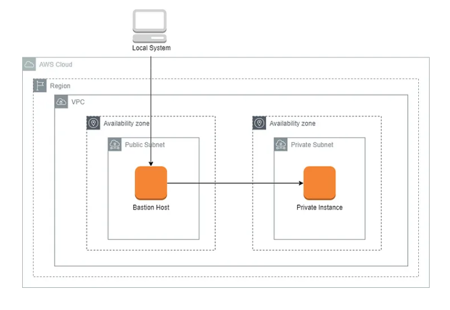

Terraform basic infrastructure setup with AWS... mostly just for practice.

Working towards this diagram setup (in progress):

- Use `backend_setup/` to create two separate AWS S3 buckets for TF State storage (development and production)
- The TF State for the backend is managed locally (init and apply from within `backend_setup/`)
- Update the bucket name in the appropriate providers.tf file: `environments/<env>/providers.tf`
- terraform init/apply from `environments/dev` or `environments/prd`
