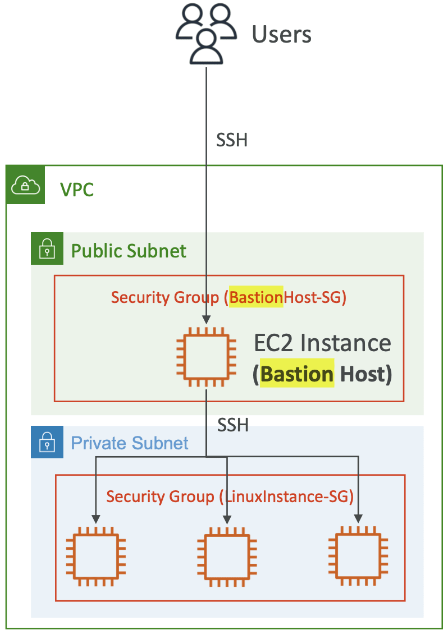

Terraform basic infrastructure setup with AWS for practice.

Working towards this diagram setup: 

- Use `backend_setup/` to create two separate AWS S3 buckets for TF State storage (development and production)

- The TF State for the backend is managed locally (init and apply from within `backend_setup/`)

- Update the bucket name in the appropriate backend.hcl file: `environments/<env>/backend.hcl`

- terraform init/apply from `environments/dev` or `environments/prd`

- Provide the backend config path: `terraform init -backend-config=backend.hcl`

- Before init/apply, create an SSH keypair: `ssh-keygen -b 2048 -t rsa -f infra-key` from within `environments/<env>`

- Save the private infra-key file to SSH onto the Bastion EC2, the infra-key.pub can be deleted after init/apply (it gets installed onto the EC2 instance)

- SSH to bastion host: `ssh -i infra-key ec2-user@<bastion-host Public IP>`

- Or SSH to bastion host and then to the private instance:
<pre><code>ssh-add infra-key
ssh -A ec2-user@&lt;bastion-host Public IP&gt;
ssh ec2-user@&lt;private-instance Private IP&gt;</code></pre>
